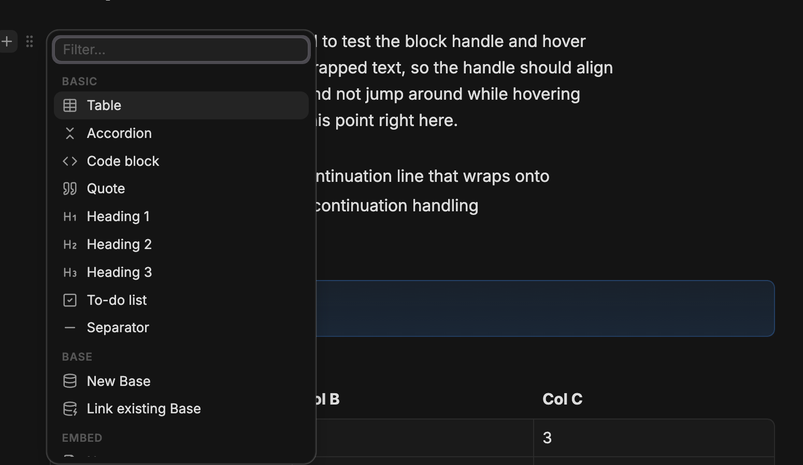

# Composer

A Notion-style block handle for Obsidian: hover any block in Live Preview to reveal a gutter handle with a **＋ insert** menu and a **⠿ block actions** menu.



## How it works

Hover over a block (paragraph, heading, list item, callout, table, code fence, quote…) and a small handle appears in the left gutter. It has two buttons:

- **＋ Insert** — opens a searchable menu to insert a new block below (⌥-click flips the default direction) the hovered block.
- **⠿ Actions** — opens a menu of transforms and operations on the hovered block itself: turn into another block type, move up/down, duplicate, copy a block link, or delete.

Empty lines get the handle too (＋ only): inserting there replaces the line in place, so a brand-new note is one hover away from its first block.

Both menus support fuzzy filtering, arrow-key navigation, `Enter` to confirm, `Esc` to close, and close on outside click. All insertions are a single undo step.

The handle only appears in Live Preview (desktop only) — it's inert in Reading view and does nothing over blank lines or frontmatter.

## Insert menu sections

| Section | Items |
|---|---|
| **Basic** | Table, Accordion (foldable callout), Code block, Quote, Heading 1–3, To-do list, Separator |
| **Base** | New Base (creates a `.base` file next to the note and embeds it), Link existing Base |
| **Embed** | Note, Image, Canvas / Excalidraw, HTML artifact |
| **Template** | Insert any note from your template folder |
| **AI** | Ask Exo — hands off to the Exo plugin's inline-edit command, if installed |

## Block actions (⠿)

**Turn into**: Paragraph, Heading 1–3, Bullet list, To-do list, Quote, Callout.
**Actions**: Move up, Move down, Duplicate, Copy block link, Delete.

## Settings

| Setting | Default | Description |
|---|---|---|
| Hover delay | `150` ms | Delay before the handle appears on hover |
| Default insert position | `below` | Where ＋ inserts relative to the hovered block (⌥-click flips it) |
| New base folder | *(same folder as note)* | Folder for bases created from the menu |
| Template folder | `Resources/Templates` | Source folder for the Template section |
| Artifact folder | `Resources/_artifacts` | Source folder for the HTML artifact embed section |
| AI section | `on` | Show "Ask Exo" in the insert menu (requires the Exo plugin) |
| Exo command id | `exo:inline-edit` | Command id Composer hands off to for "Ask Exo" |

## Install (manual dev build)

Composer is not on the community plugin store. To build and install it locally:

```bash
pnpm install
pnpm build
```

The build writes `main.js`, `manifest.json`, and `styles.css` into the plugin folder referenced by `.obsidian-plugin-dir` (your vault's `.obsidian/plugins/composer/`). Enable it from Obsidian's Community Plugins settings.

## Mobile

**Unsupported** — `isDesktopOnly: true` in `manifest.json`; the handle only appears in Live Preview and is desktop-only by design (see "How it works" above).

## Design

Styling is geometry and hover/active states only — no permanent decorative surfaces. All colors, radii, and shadows come from Obsidian's own theme variables, so Composer adapts automatically to any theme, light or dark.

---

Part of the marioverse Obsidian plugin suite.
